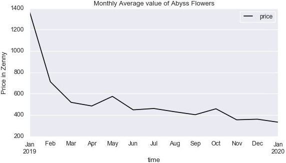

# Ragnarok Mobile - Market Price - Time Series Analysis

## Executive Summary
This notebook is a project where I can interact with the RO Mobile Exchange API (see API Docs below) and perform time series analysis on the data. The project scope is:

- Making requests and obtaining data.
- Using Data in time series analysis.
- Experiment with time series modeling.

The data coveted is the historical market value of items in the game.

## Key files
1. [Link](https://jessicayeh.github.io/rom-exchange-openapi/#section/Recent-Changes) to API Docs
2. ROMExchange.db: sqlite database containing historical market value prices of items.
3. Romobile_timeseries_analysis.ipynb: main project notebook

# Methodology

1. **Importing Libraries**  
2. **Making requests**  
3. **Extract Transfer Load**  
4. **Cleaning Data**  
5. **Exploratory Data analysis**  
5. **Time series modeling**  

# Key Findings
The API used to obtain the data stopped collecting real time item data in January 2020. 
Obtaining the data using the API and importing it into a Pandas DataFrame was straightforward. 

Data is distributed into one of two main categories: Global and SEA Server.
There are intriguing differences between item value between the servers.

High priority items of interest tend to start with high value when they are new to the market.
Observe the following visualisation made of the ' Abyss Flower' Item:

  
This monthly average shows the typical trend of such high priority items in game.

The data is collected at irregular time intervals. Which makes time series analysis less straightforward.
The reading points to building a continuous time stochastic model.

# Conclusions

To be made.
# Recommendations for future research
To be made.